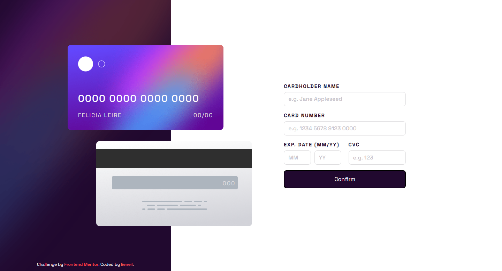

# Frontend Mentor - Interactive card details form solution

This is a solution to the [Interactive card details form challenge on Frontend Mentor](https://www.frontendmentor.io/challenges/interactive-card-details-form-XpS8cKZDWw). Frontend Mentor challenges help you improve your coding skills by building realistic projects. 

## Table of contents

- [Overview](#overview)
  - [The challenge](#the-challenge)
  - [Screenshot](#screenshot)
  - [Links](#links)
- [My process](#my-process)
  - [Built with](#built-with)
  - [What I learned](#what-i-learned)
  - [Useful resources](#useful-resources)

## Overview

### The challenge

Users should be able to:

- Fill in the form and see the card details update in real-time
- Receive error messages when the form is submitted if:
  - Any input field is empty
  - The card number, expiry date, or CVC fields are in the wrong format
- View the optimal layout depending on their device's screen size
- See hover, active, and focus states for interactive elements on the page

### Screenshot

 <br/><br/>


### Links

- [Live Demo](https://njvs.github.io/Social-media-dashboard/)

## My process

### Built with

- HTML/CSS
- Vanilla Javascript
- CSS custom properties
- [SASS/SCSS](https://sass-lang.com) - CSS with superpower
- Flexbox
- CSS Grid
- Responsive Web Design


I really enjoyed doing this challenge, and I'm very satisfied with the solution.

I use `Javascript Promise` for form validation. At first, I planned to write a simple function that returns true if there are no invalid inputs, but the problem is that after running this function, I'll need to add another `if-statement` inside the submit event to check if the function returns true. And I think that's a redundant code.

With Promise, I could just `resolve` it and pass the form data, or `reject` it and pass the invalid inputs and prevent the form from submitting. Tho this project prevents the default form submit event if there's an invalid input. I had intended to create reusable form validation, and I believe this is an excellent example of why using Promise is better than my initial solution.

```js
document.querySelector('form#cardInfo').addEventListener('submit', event => {
    event.preventDefault();

    validateForm(new FormData(event.target))
      .then(data => {
        // POST request here...

        // add "resolve" class
        document.querySelector('section.form-container').classList.add('resolved');
      })
      .catch(inputs => {
        // event.preventDefault();

        // highlight invalid inputs
        inputs.forEach(inp => showInvalidInput(inp))
      });
});

function validateForm(formData) {
  return new Promise((resolve, reject) => {
    const invalidInputs = [];
    
    // check each data
    for (const [id, value] of formData) {
      const input = document.querySelector(`#${id}`);

      // rules
      const reqLength = input.getAttribute('maxlength');
      const pattern = new RegExp(input.pattern);

      // check blank input
      if (value === '') {
        invalidInputs.push( {id: id, msg: "Can't be blank"} );
      }
      // required length (maxlength input attribute)
      else if (value.length != reqLength && reqLength !== null) {
        invalidInputs.push( {id: id, msg: `Must have ${(id === 'inp_cardNumber') ? 16 : reqLength} characters`} );
      }
      // required pattern 
      else if ( !pattern.test((id === 'inp_cardNumber') ? value.replace(/(\s+)/g, '') : value) ) {
        invalidInputs.push( {id: id, msg: `Wrong format`} );
      }
    }

    // if there were no invalid input, resolve promise end pass formData, 
    // else reject and pass invalid input 
    if (invalidInputs.length === 0) {
      resolve(formData);
    } else {
      reject(invalidInputs);
    }
  });
}
```
<br/><br/>

Also, as for this project requirements, every time the user input a value, the card is automatically updated(real-time). To do this, the `card id` must be the same as the `input id` without `inp_` for example, `cardHolder` and `inp_cardHolder`. I've also added default card value in case the user erased the value after entering one.
```js
document.querySelectorAll('#cardInfo input:not([type=submit])').forEach(elem => {
  elem.addEventListener('input' e => updateCard(e.target.id, e.target.value));
});

function updateCard(id, value) {
  const defaultVal = {
    inp_cardHolder: 'Jane Appleseed',
    inp_cardNumber: '0000 0000 0000 0000',
    inp_cardDateMonth: '00',
    inp_cardDateYear: '00',
    inp_cardCvc: '000'
  };

  document.querySelector(`#${id.replace(/inp_/g, '')}`).innerHTML = (value !== '') ? value : defaultVal[id];
}
```

### Useful resources

- [Javascript Promise](https://javascript.info/promise-basics)
- [String.prototype.padStart()](https://developer.mozilla.org/en-US/docs/Web/JavaScript/Reference/Global_Objects/String/padStart)
- [A Complete Guide to Grid](https://css-tricks.com/snippets/css/complete-guide-grid/) - I alway open this guide everytime I use CSS Grid
- [A Complete Guide to Flexbox](https://css-tricks.com/snippets/css/a-guide-to-flexbox/) - This is for CSS Flexbox
- [An opinionated styleguide for writing sane, maintainable and scalable Sass.](https://sass-guidelin.es/)